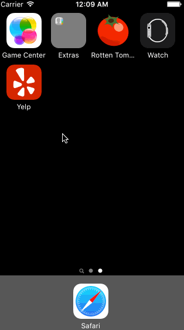

## CodePath Week 2: Yelp

This is a Yelp client that uses the [Yelp Search API](http://www.yelp.com/developers/documentation/v2/search_api). This is also the assignment for Week 2 of the [CodePath](http://www.codepath.com) iOS for Engineers class for Fall 2015, built with [Xcode 7.0](https://developer.apple.com/xcode/download/) and Swift. 

My laptop screen broken down during this past week (e.g. "the dog ate my homework"). Also, while trying to understand & finish this homework (on an external monitor), my parents kept calling about scheduling our family trip to Hawaii ASAP. It was rough, but I was able to code things up on time, and also book some plane tickets plus order a replacement laptop on eBay. Whew! :)

Time spent: 12 hours

#### Required Features: Search results page

- [X] Table rows should be dynamic height according to the content height.
- [X] Custom cells should have the proper Auto Layout constraints.
- [X] Search bar should be in the navigation bar.

#### Required Features: Filter page

- [X] The filters you should actually have are: category, sort (best match, distance, highest rated), radius (meters), deals (on/off).
- [X] The filters table should be organized into sections as in the mock.
- [X] You can use the default UISwitch for on/off states. 
- [X] Clicking on the "Search" button should dismiss the filters page and trigger the search w/ the new filter settings.

#### Video Walkthrough


Credits
---------
* [Yelp Search API](http://www.yelp.com/developers/documentation/v2/search_api)
* [Baseline implementation from CodePath](https://github.com/codepath/ios_yelp_swift)
* [CodePath writeup for understanding sections](https://guides.codepath.com/ios/Table-View-Guide#working-with-sections)
* [Implementation from monisun for understanding sections](https://github.com/monisun/yowl)
* [Implementation from jerrysu for understanding sections](https://github.com/jerrysu/CodePath-Yelp)
* [LiceCap for making the animated gif](http://www.cockos.com/licecap/)


```
